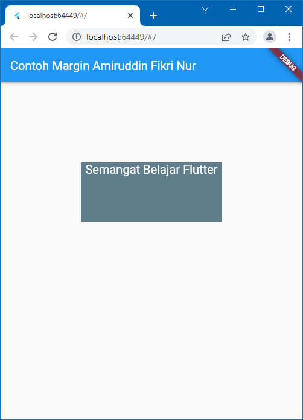

# flutter_basic

    Nama    : Amiruddin Fikri Nur
    NIM     : 2031710163
    Kelas   : MI-2C
    Absen   : 06

## Build In Widget
1. Text Widget

2. Image Widget

3. Material Design dan iOS Cupertino

4. Button

5. Scaffold

6. Dialog

7. Input dan Selection Widget

8. Date and Time Pickers

## Build In Layout Widget
### Container 
1. Property child

2. Property alignment

3. Property color

4. Property height and width

5. Property margin

6. Property padding

7. Property transform

8. Property decoration

### Row dan Column
1. Column Widget

2. Row Widget

### Stack

### ListView

### GridView
